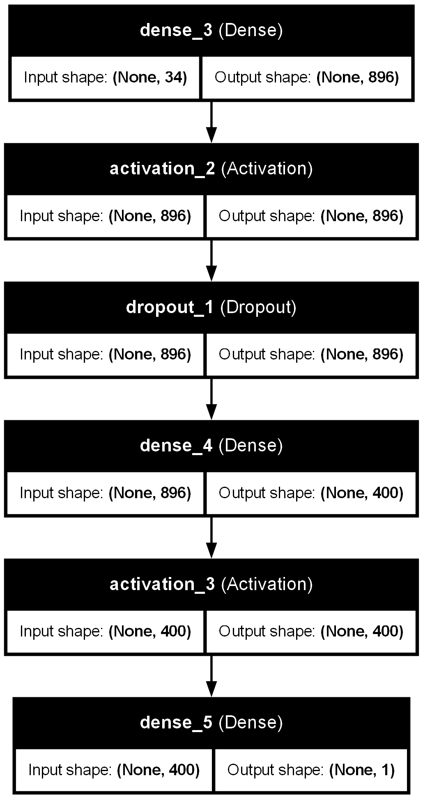
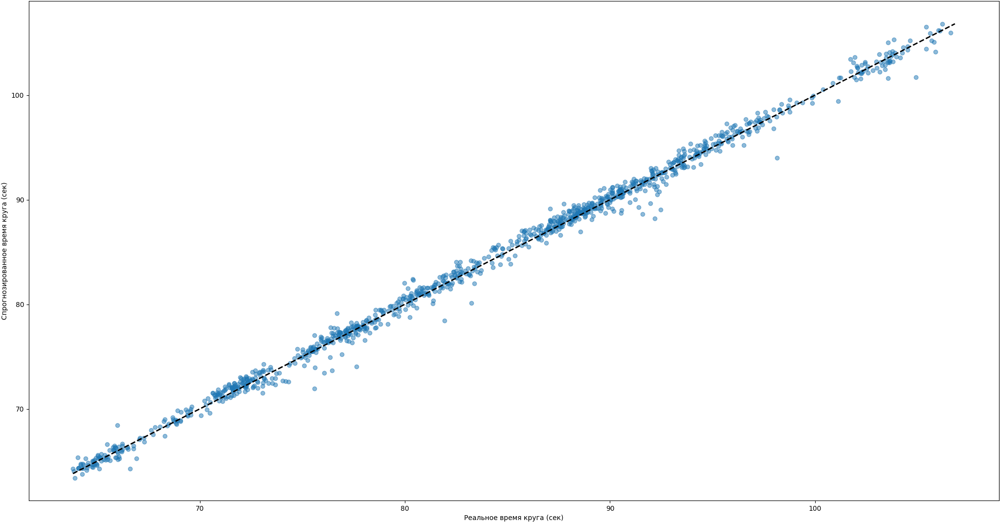
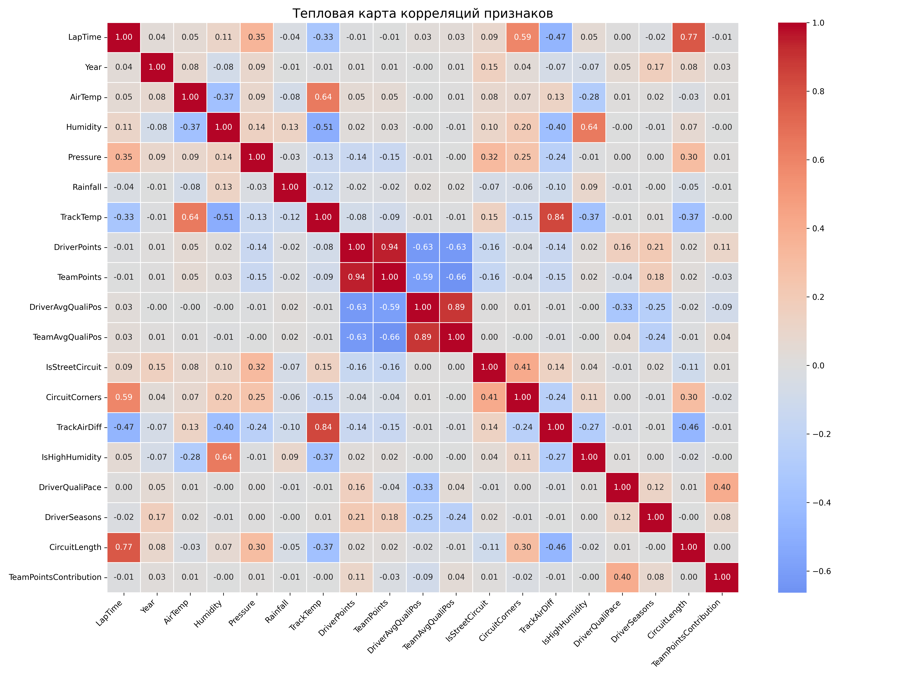

<h1 align="center" style="margin-top: 0; margin-bottom: 0;">Apex-Predict-Model<br>Модель прогнозирования квалификационного времени круга гонщика Формулы 1</br></h1>
Проект для прогнозирования времени круга в Формуле-1 с использованием нейронной сети.
Данный репозиторий содержит в себе датасет квалификационных кругов Формулы 1, а также модель прогнозирования квалификационного времени круга гонщика и методы, необходимые для ее создания. Полученная модель используется в мобильном приложении <a href="https://github.com/qum11ch/Apex">Apex</a>.


## Описание

Данный репозиторий содержит код для подготовки данных, построения и обучения модели нейронной сети, а также для прогнозирования времени круга гонщика.

Основные компоненты:

- Загрузка и предобработка данных
- Архитектура нейронной сети
- Обучение и настройка гиперпараметров
- Методы для прогнозирования и анализа результатов

## Структура проекта

- `main.py` — основной модуль для обучения модели на собранном датасете
- `analyse.py` — модуль, осуществляющий анализ собранного датасета (отчистка от выбросов, расчет метрик)
- `predictor.py` — модуль тестового прогнозирования
- `dataset.py` — модуль, в котором собирается датасет
- `models/` — директория, содержащая полученные модели CatBoost и разработанную модель нейронной сети
- `preprocessors/` — дериктория, содержащая препроцессоры, необходимые для кодирования и масштабирования входных данных
- `tuner_dir/` — дериктори, содержащая результаты подбора гиперпараметров
- `requirements.txt` — список зависимостей

## Архитектура модели

<p align="center">
   
</p>

<br> Модель состоит из 2 скрытых слоев с функцией активации Swish, между которыми находится Dropout слой. В каждом из слоев используется L2 регуляризация. Все гиперпараметры были подобраны при помощи Keras Tuner с алгоритмом Bayesian Optimization </br>
<br> Перед обучением модели датасет был предобработан: для категориальных переменных использовались OneHotEncoder и CatBoostEncoder; для количественных пременных применялся RobustScaler. **Целевая переменная (время круга) тоже была масштабирована при помощи RobustScaler**. Помимо этого, была получена допольнительная переменная - сгенерированное время круга на входных данных при помощи CatBoostRegressor. По итогу модель принимает на вход 34 переменные.</br>

## Результаты обучения модели

<p align="center">
   
   <em>Сопоставление спрогнозированных времен с реальными</em>
</p>

Обученная модель имеет следующие метрики:
| Метрика      | Значение              |
|--------------|-----------------------|
| R² Score     | 0.9956638135715368     |
| MSE error    | 0.4960949462309913     |
| Huber loss   | 0.19708141616416952    |
| MAE error    | 0.4844626967118148     |
| MAPE loss    | 0.005754749591898151   |

Высокое значение коэффициента детерминации (0.996), относительно низкая MSE (0.48 MSE ≈ 0.48с ошибки) и MAPE равный 0.5% позволяет использовать модель для прогнозирования, но требует улучшения для повышения точности прогноза.
<br></br>В рамках оценки эффективности разработанной модели был проведён сравнительный анализ с результатами, полученными при использовании языковой модели общего назначения (ChatGPT-4).
<br></br>Для сравнения были выбраны квалификационные сессии нескольких Гран-при сезона Формулы 1 2025 года. Разработанная модель получала на вход полный набор нормализованных числовых признаков: тип трассы, температура воздуха и асфальта, позиция гонщика в чемпионате, данные по предыдущим кругам и вспомогательные признаки, сгенерированные с помощью CatBoostRegressor. В свою очередь, языковая модель получала текстовый запрос вида:
<br></br>*«Какое ориентировочное время круга в квалификации покажет пилот <Фамилия> на Гран-при <Название> 2025 года, учитывая текущую форму команды, конфигурацию трассы и исторические данные?»*

| Гран-При | Пилот  | Фактическое время круга (с) | Прогноз модели (с) | МАЕ (модель) | Прогноз ChatGPT (с) | МАЕ (ChatGPT) |
|----------|--------|-----------------------------|-----------------------|--------------|---------------------|---------------|
| Монако   | Norris | 69.95                       | 70.16                 | 0.21         | 71.10               | 1.15          |
| Имола    | Piastri| 74.67                       | 74.75                 | 0.08         | 75.07               | 0.40          |
| Монако   | Hadjar | 70.92                       | 71.32                 | 0.40         | 72.60               | 1.68          |

В результате полученная модель показала в среднем **в 4.6 раза лучше** значения, чем ChatGPT-4. 

## Собранный датасет

При обучении модели используется собственно собранный датасет. Он собран, основываясь на публичном API [jolpica-f1](https://github.com/jolpica/jolpica-f1), а также на собственных данных. Датасет представляет из себя данные о квалификациях кругах гонщиков с 2018 года, учитывая статистику и погодные условия. *В качестве квалификационного круга, подходящего для записи в датасет, понимается время, вошедшее в 107% от времени лидера*
<br></br>В случае, если записанные круги квалификации пришлись на первую гонку в сезоне, то в качестве данных в полях DriverPoints, TeamPoints, DriverAvgQualiPos, TeamAvgQualiPos используются результаты **предыдущего сезона**.

<br>Пример собранного датасета
| Driver | Team     | LapTime | Year | AirTemp | Humidity | Pressure | Rainfall | TrackTemp | DriverPoints | TeamPoints | DriverAvgQualiPos | TeamAvgQualiPos | IsStreetCircuit | F1Era    | CircuitCorners | TrackAirDiff | IsHighHumidity | DriverQualiPace | DriverSeasons | CircuitLength | TeamPointsContribution | Event | CircuitId    | CarEngine |
|--------|----------|---------|------|---------|----------|----------|----------|-----------|--------------|------------|-------------------|-----------------|-----------------|----------|----------------|--------------|----------------|-----------------|---------------|---------------|------------------------|-------|--------------|-----------|
| HAM    | Mercedes | 82.051  | 2018 | 24.9    | 57.6     | 1007.9   | False    | 31.6      | 363.0        | 668.0      | 3.4               | 3.2             | True            | WideAero | 14             | 6.7          | False          | -0.2            | 11            | 5.278         | 0.54                   | Q3    | albert_park  | Mercedes  |
| HAM    | Mercedes | 81.164  | 2018 | 24.5    | 60.5     | 1007.9   | False    | 30.5      | 363.0        | 668.0      | 3.4               | 3.2             | True            | WideAero | 14             | 6.0          | False          | -0.2            | 11            | 5.278         | 0.54                   | Q3    | albert_park  | Mercedes  |
| RAI    | Ferrari  | 82.251  | 2018 | 24.5    | 60.3     | 1007.9   | False    | 30.4      | 205.0        | 522.0      | 3.8               | 3.55            | True            | WideAero | 14             | 5.9          | False          | -0.25           | 15            | 5.278         | 0.39                   | Q3    | albert_park  | Ferrari   |
| RAI    | Ferrari  | 81.828  | 2018 | 24.6    | 60.7     | 1007.9   | False    | 30.5      | 205.0        | 522.0      | 3.8               | 3.55            | True            | WideAero | 14             | 5.9          | False          | -0.25           | 15            | 5.278         | 0.39                   | Q3    | albert_park  | Ferrari   |
| VET    | Ferrari  | 82.085  | 2018 | 24.9    | 59.6     | 1007.9   | False    | 30.2      | 317.0        | 522.0      | 3.3               | 3.55            | True            | WideAero | 14             | 5.3          | False          | 0.25            | 11            | 5.278         | 0.61                   | Q3    | albert_park  | Ferrari   |
| VET    | Ferrari  | 81.838  | 2018 | 24.9    | 60.0     | 1007.9   | False    | 29.9      | 317.0        | 522.0      | 3.3               | 3.55            | True            | WideAero | 14             | 5.0          | False          | 0.25            | 11            | 5.278         | 0.61                   | Q3    | albert_park  | Ferrari   |

<br>Поля датасета представлены ниже
| Поле                     | Описание                                                |
| ------------------------ | ------------------------------------------------------- |
| `Driver`                 | Код гонщика(например, HAM — Lewis Hamilton)    |
| `Team`                   | Название команды гонщика                                |
| `LapTime`                | Время круга в секундах или формате ss.SSS           |
| `Year`                   | Год проведения квалификации                                  |
| `AirTemp`                | Температура воздуха (в градусах Цельсия)                |
| `Humidity`               | Влажность воздуха (%)                                   |
| `Pressure`               | Атмосферное давление (гПа)                              |
| `Rainfall`               | Наличие осадков (True/False)                            |
| `TrackTemp`              | Температура трассы (в градусах Цельсия)                 |
| `DriverPoints`           | Набранные очки гонщиком в сезоне                        |
| `TeamPoints`             | Набранные очки командой в сезоне                        |
| `DriverAvgQualiPos`      | Средняя позиция гонщика в квалификации                  |
| `TeamAvgQualiPos`        | Средняя позиция команды в квалификации                  |
| `IsStreetCircuit`        | Индикатор уличной трассы (True/False)                   |
| `F1Era`                  | Эра Формулы 1 (WideAero, GroundEffect)        |
| `CircuitCorners`         | Количество поворотов на трассе                          |
| `TrackAirDiff`           | Разница температуры воздуха и трассы                    |
| `IsHighHumidity`         | Высокая влажность (True/False)                          |
| `DriverQualiPace`        | Темп гонщика относительно команды в квалификациях (разница средней позиции команды и средней позиции гонщика) |
| `DriverSeasons`          | Количество сезонов гонщика                              |
| `CircuitLength`          | Длина трассы (в километрах)                             |
| `TeamPointsContribution` | Вклад гонщика в очки команды (доля набранных очков гонщика в очках команды)                             |
| `Event`                  | Этап квалификации (например, Q3 — третья часть квалификации)   |
| `CircuitId`              | Идентификатор трассы                                    |
| `CarEngine`              | Производитель двигателя команды гонщика                                    |

Собранный датасет был очищен от выбросов на целевой переменной (времени круга, она же LapTime) при помощи метода IsolationForest. **Итого: 10728 строк и 25 полей**

Для оценки степени линейной взаимосвязи между признаками и выявления потенциальные источники мультиколлинеарности или низкоинформативных переменных была составлена тепловая карта корреляций числовых признаков и целевой переменной:
<p align="center">
   
</p>

Более подробно создание датасета вы сможете рассмотреть в методе [dataset.py](./dataset.py).

## Установка и запуск

1. Клонируйте репозиторий:

   ```bash
   git clone https://github.com/qum11ch/Apex-Predict-Model.git
   cd Apex-Predict-Model
   ```

2. Создайте виртуальное окружение и активируйте его:

   ```bash
   python -m venv venv
   source venv/bin/activate  # Linux/MacOS
   venv\Scripts\activate   # Windows
   ```

3. Установите зависимости:

   ```bash
   pip install -r requirements.txt
   ```

4. Запустите обучение модели:

   ```bash
   python main.py
   ```

5. Для проверки прогнозирования обученной модели используйте:

   ```bash
   python predictor.py
   ```

## Вклад

Если вы хотите внести изменения или улучшения, создайте форк, сделайте изменения и отправьте Pull Request.


## Лицензия

MIT License. Подробнее в файле LICENSE.


## Контакты

Если у вас есть вопросы или предложения, вы можете связаться с автором проекта:

Email: f1.app@mail.ru

Email: sharapatov.n@mail.ru

GitHub: https://github.com/qum11ch


## Отказ от ответственности / Disclaimer

Этот репозиторий является неофициальным и никак не связано с компаниями Формулы-1.  
F1, FORMULA ONE, FORMULA 1, FIA FORMULA ONE WORLD CHAMPIONSHIP, GRAND PRIX и связанные с ними знаки являются торговыми марками Formula One Licensing B.V.

This repository is unofficial and is not associated in any way with the Formula 1 companies.  
F1, FORMULA ONE, FORMULA 1, FIA FORMULA ONE WORLD CHAMPIONSHIP, GRAND PRIX and related marks are trade marks of Formula One Licensing B.V.
